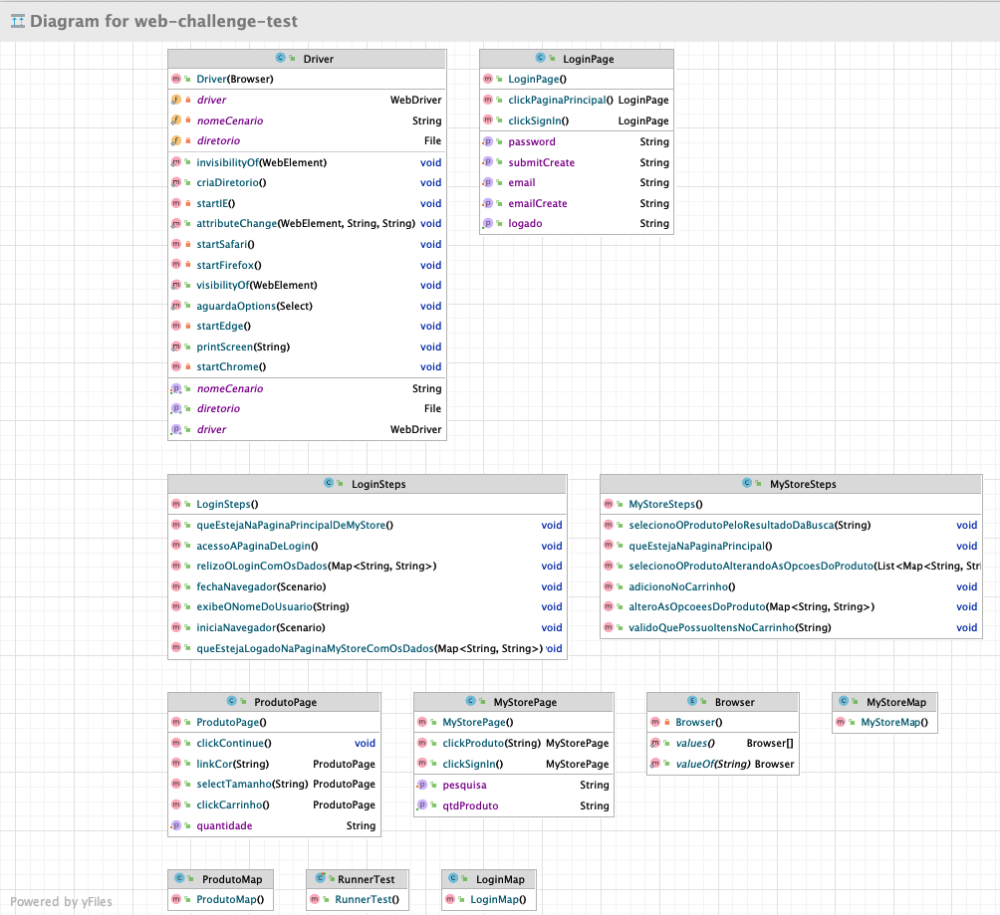

# _Web Challenge test_
### _Test automation project was developed to simply and efficiently demonstrate tests on the Web platform with support for behavior-oriented development._

[](https://travis-ci.org/joemccann/dillinger)
[]()
[]()
[]()
[]()
[](https://https://maven.apache.org/)
[](https://confluence.jetbrains.com/display/ALL/JetBrains+on+GitHub)
## Tech

- [Java](https://docs.oracle.com/en/java/javase/17/) - JDK 17 Documentation - Programming language
- [Selenium](https://www.selenium.dev/) - Automates browsers
- [Cucumber](https://cucumber.io/) - Validate executable specifications
- [Junit](https://junit.org/junit5/) - Testing framework for Java and the JVM
- [Intellij](https://www.jetbrains.com/pt-br/idea/) - Software development IDE

## Installation

- Create a folder with the name of your choice, I suggest creating it with the name GIT
- Clone the project
```shell
$ git clone https://github.com/carlospmbarros/web-challenge-test
```
- With intellij open, click open and go to the folder where the project was cloned and double-click
- Wait until the build is finished and the project is ready to be used


## Execution

- Running it through the terminal
```shell
$ mvn test
```
- Using tags in execution through the terminal, where the item @tag Name will be replaced by the tag found in the .FEATURE file inside the resources/features folder, ex: **@addProduct**
```shell
$ mvn test -Dcucumber.options="--tags @tag Name"
```
- Running your tests via project runner
- Before doing the procedure below, open the RunnerTest file and validate that the tag that will be used is the same one associated with the test scenarios within the .FEATURE files
-- Go to the runner folder that is in the path _**src/test/java/dev/carlosbarros/runner/**_ and with the right button of the project click on the **_RunnerTest.java_** class and click run ... this will make the project run through cucumber runner

### Folders

- [x] _**Core**_ - Where are all global settings located
- [x] _**Enums**_ - Browsers are associated with the enumerator class
- [x] _**Maps**_ - Mapping html elements
- [x] _**Pages**_ - Where are all the page objects
- [x] _**Steps**_ - Test scenarios described in .feature files are developed behaviors
- [x] _**Runner**_ - Cucumber based test runner
- [x] _**Resources/Features**_ - Description of test scenarios that meet the demands of the business area and system behavior


## Project Structure



